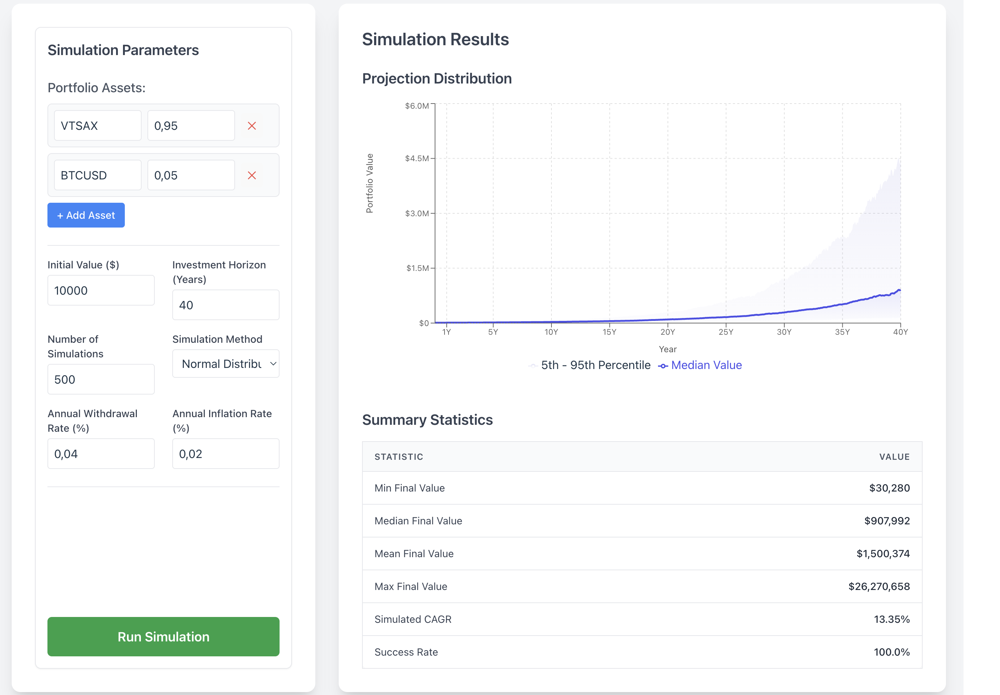

# Portfolio Growth Simulator

## Description

The Portfolio Growth Simulator is a full-stack web application designed to project the potential growth of an investment portfolio over time using Monte Carlo simulation methods. Users can define a portfolio with multiple assets and their weights, specify initial investment, investment horizon (in years), withdrawal strategies, and inflation rates. The application then runs simulations to provide a probabilistic view of potential outcomes, visualized through charts and summary statistics.

This project demonstrates capabilities in backend development with Go, frontend development with React and TypeScript, API design, and the application of financial modeling concepts.

## Features

* **Dynamic Portfolio Input**: Define a portfolio consisting of multiple assets (e.g., stocks, ETFs like VTSAX, BTCUSD) and their respective weights (e.g., 0.95 for 95%).
* **User-Friendly Parameters**:
    * Input for initial investment value.
    * Investment horizon specified in **years**.
    * Number of simulation paths.
    * Selection of simulation method: "Normal Distribution" or "Historical Bootstrap".
    * Annual withdrawal and inflation rates inputted as **decimals** (e.g., 0.04 for 4%).
* **Monte Carlo Simulation Backend**:
    * Calculates historical monthly portfolio returns based on input weights.
    * Simulates future paths considering withdrawals and inflation.
* **Results Visualization**:
    * **Projection Chart**: An area chart displaying the median portfolio value over time, along with the 5th and 95th percentile bands. The X-axis is displayed in years, corresponding to the input horizon.
    * **Summary Statistics Table**: Shows key metrics: Min, Max, Mean, and Median final portfolio values, Simulated CAGR, and Success Rate.
* **Responsive UI**: Built with Tailwind CSS.

## Screenshot

The application interface allows users to input simulation parameters on the left and view the projected distribution chart and summary statistics on the right.


## Tech Stack

* **Backend**:
    * Go (version 1.24+)
    * Standard `net/http` library for API server.
    * Tiingo API for fetching historical financial data.
* **Frontend**:
    * React (v18+)
    * TypeScript
    * Vite for frontend tooling
    * Tailwind CSS for styling
    * Recharts for data visualization
* **Development**:
    * Node.js (version v23.11.0+) and npm/yarn.
    * Unit and integration tests for backend components.

## Prerequisites

Before you begin, ensure you have the following installed:

* Go (version 1.24 or higher).
* Node.js (version 23.11.0 or higher) and npm or yarn.
* A Tiingo API Key. Register at [Tiingo's website](https://www.tiingo.com/) to get one.

## Setup and Installation

1.  **Clone the repository:**
    ```bash
    git clone https://github.com/glindstrom/portfolio-simulator
    cd portfolio-simulator # 
    ```

2.  **Backend Setup:**
    * Navigate to the backend directory:
        ```bash
        cd backend
        ```
    * Set the `TIINGO_API_KEY` environment variable. You can do this by:
        * Exporting it in your shell: `export TIINGO_API_KEY=YOUR_ACTUAL_KEY` (for the current session)
        * Or prefixing the run command: `TIINGO_API_KEY=YOUR_ACTUAL_KEY go run cmd/server/main.go`
        * Alternatively, for persistent local development, create a `.env` file in the `backend` directory (note: this project's `main.go` doesn't automatically load `.env` files; you'd add a library like `godotenv` for that or continue using shell-exported variables).
            ```env
            # backend/.env (if you implement .env loading)
            TIINGO_API_KEY=YOUR_ACTUAL_TIINGO_API_KEY
            ```
    * Install Go dependencies (if Go modules are used and need tidying):
        ```bash
        go mod tidy
        ```

3.  **Frontend Setup:**
    * Navigate to the frontend directory (e.g., `frontend`):
        ```bash
        cd ../frontend 
        ```
    * Install Node.js dependencies:
        ```bash
        npm install
        # OR
        yarn install
        ```

## Running the Project

1.  **Start the Backend Server:**
    * Navigate to the backend server command directory:
        ```bash
        cd backend/cmd/server
        ```
    * Run the server (ensure `TIINGO_API_KEY` is set in your environment or prefixed):
        ```bash
        # If key is already exported:
        go run main.go
        # Or, with key prefixed:
        # TIINGO_API_KEY=YOUR_KEY go run main.go
        ```
    * The backend server will start on `http://localhost:8085`.

2.  **Start the Frontend Development Server:**
    * Open a new terminal window.
    * Navigate to the frontend directory:
        ```bash
        cd frontend # Or your frontend directory path
        ```
    * Start the React development server:
        ```bash
        npm run dev
        # OR
        yarn dev
        ```
    * The frontend application will usually open in your browser automatically or be available at `http://localhost:5173`.

## API Endpoint

The backend exposes a single primary API endpoint:

* **Endpoint**: `POST /api/simulate`
* **Request Body** (JSON):
    * `portfolio`: Array of `{"ticker": "string", "weight": float}` objects (e.g., weight 0.5 for 50%).
    * `initialValue`: float (e.g., 10000).
    * `periods`: integer (total number of **months** for simulation, e.g., 40 years * 12 months/year = 480 periods).
    * `simulations`: integer (e.g., 1000).
    * `method`: string ("normal" or "bootstrap").
    * `withdrawalRate`: float (annual rate as a decimal, e.g., 0.04 for 4%).
    * `inflation`: float (annual rate as a decimal, e.g., 0.02 for 2%).
    ```json
    {
      "portfolio": [
        {"ticker": "VTSAX", "weight": 0.95},
        {"ticker": "BTCUSD", "weight": 0.05}
      ],
      "initialValue": 10000,
      "periods": 480,
      "simulations": 500,
      "method": "normal",
      "withdrawalRate": 0.04,
      "inflation": 0.02
    }
    ```
* **Response Body** (JSON):
    ```json
    {
      "paths": [[10000, 10100, ...], ...],
      "finalStats": {
        "mean": 1500374,
        "median": 907992,
        "min": 30280,
        "max": 26270658
      },
      "successRate": 1.0,
      "simulatedCagr": 0.1335
    }
    ```

## Project Assumptions

* **Historical Data**: Simulation relies on historical monthly returns from Tiingo to model future return characteristics.
* **Portfolio Returns (Historical)**: The historical monthly returns for the overall portfolio (used as input to the simulation model) are calculated using a weighted average of individual asset returns. The weights are the *initial target weights* set by the user. This effectively models a portfolio that was rebalanced back to these target weights *monthly* during the historical period from which returns are derived.
* **Withdrawals**: User specifies an *annual* withdrawal rate (as a decimal, e.g., 0.04 for 4%). This rate is applied to the *initial* portfolio value to determine an initial annual withdrawal amount. This annual amount is then divided by 12 to get a base monthly withdrawal, which is then adjusted for inflation each month and subtracted from the portfolio.
* **Inflation**: The user-specified *annual* inflation rate (decimal) is applied to adjust monthly withdrawals.
* **No Taxes or Fees**: The simulation does not account for taxes or transaction/management fees.
* **Success Definition**: A simulation path is "successful" if its value does not drop to zero or below during the simulation period.

## Limitations

* **Data Provider (Tiingo)**: Relies on the Tiingo API. The free tier may have limitations (API call frequency, data depth, ticker coverage for all desired assets). Some specific international ETFs might not be available or may require a premium subscription.
* **Model Simplification**: Financial models are simplifications. Market complexities and rare events ("black swans") are not explicitly modeled.
* **Rebalancing in Simulation**: While the *historical portfolio return series* implies monthly rebalancing to target weights, the *Monte Carlo simulation paths themselves* evolve based on sampled returns and withdrawals without further explicit rebalancing during the simulated future.
* **User State**: The application does not currently save user inputs or simulation results between sessions.

## Potential Future Enhancements

* Support for periodic contributions (e.g., monthly, annually).
* User-selectable rebalancing strategies (e.g., annual, threshold-based) *within* the simulation paths.
* Option for users to specify the historical date range for fetching data.
* Saving and loading of portfolio configurations and simulation parameters.
* More advanced risk metrics and output visualizations.

---